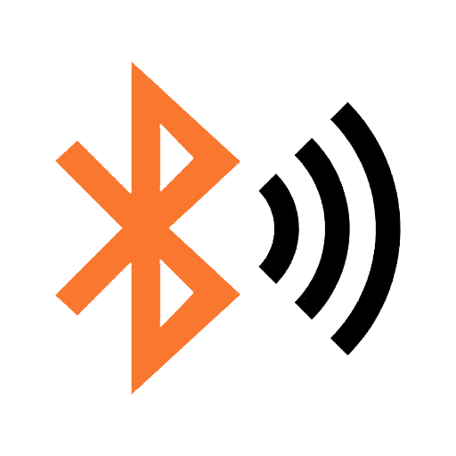
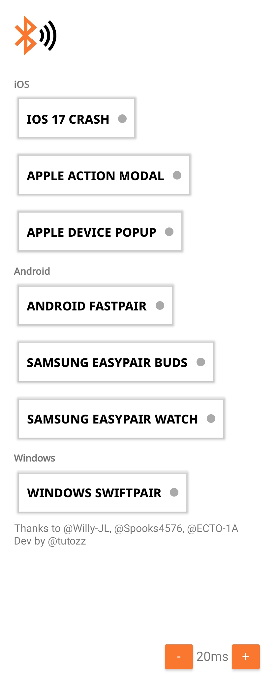
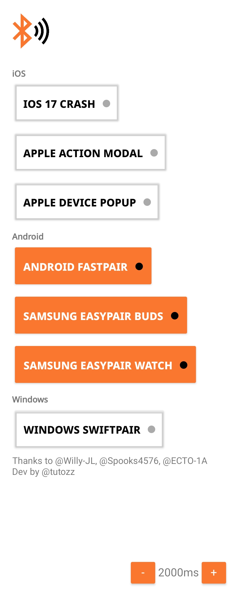
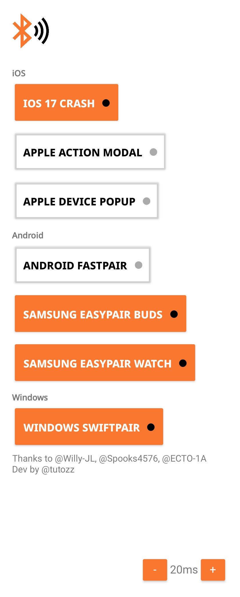

# BLE Spammer App 📡

## Overview 📋
🕵️‍♂️ Based on the work of [Willy-JL](https://github.com/Willy-JL), [Spooks4576](https://github.com/Spooks4576), and [ECTO-1A](https://github.com/ECTO-1A), this Android app extends the capabilities of the Flipper Zero BLE Spam tool, enabling protocol spoofing across a wide range of devices and operating systems. It currently supports Apple Continuity Protocol, Google Fast Pair Protocol, Samsung EasySetup Protocol, and Microsoft SwiftPair Protocol.

## Key Features 🔑
### Apple Continuity Protocol Spoofing 🍏
- Spoof Nearby Actions Modals and Proximity Pair Popup on iOS and iPadOS devices.
- Trigger system crashes on iOS 17 (iPhone 12 or newer), leading to a reboot.

### Google Fast Pair Protocol Spoofing 🤖
- Emulate Google Fast Pair Protocol, compatible with most modern Android phones.
- More than 195 different devices spoofed.

### Samsung EasySetup Protocol Spoofing 📲
- Mimic the Samsung EasySetup Protocol for Buds and Watch devices.
- The most effective way for Android, the target phone/tablet is literally unusable while activated.

### Microsoft SwiftPair Protocol Spoofing 💻
- Spoof Microsoft's SwiftPair Protocol, simplifying device pairing on Windows.
- Spoof devices with the name of your choice.

## Requirements 📦
- Android 8.0 (API level 26) or later

## Installation 🚀
Get started with the BLE Spammer App through two simple methods:

### Prebuilt APK (Recommended) 📦
- Download the prebuilt and signed APK from the [Release section](#).

### Building from Source 🛠️
- Clone this repository and open it in Android Studio.
- Compile the app to create a customized APK.

## Usage 🚀
Experiment with BLE protocol spoofing like a pro:

1. Launch the app.
2. Configure the delay between each packet (recommended: 500ms or 1000ms).
3. Select the protocol you want to spoof from the available options.

**Note**: Combine multiple protocols for ultimate flexibility (performance may be affected).

## Customization 🛠️
While the current version offers packet delay customization, future updates promise even more fine-tuned options. 🚀 Developers and contributors are invited to expand the realm of BLE protocol spoofing and uncover its hidden intricacies.

## Known Limitations ⚠️
Here's what you should know:

- Restricted to the device's internal Bluetooth antenna, leading to a limited operational range.
- Hardware limitations might affect range, speed, and effectiveness.

## Screenshots 📸
Here are some screenshots of the app in action:

**Caution**: This repository serves educational purposes exclusively. The maintainers are not responsible for any misuse or consequences arising from the application of this code.

---
**Disclaimer**: Comply with the applicable laws and regulations while using this app. Unlawful or improper use may lead to severe legal consequences.

Your expertise and contributions are instrumental in shaping the future of BLE protocol exploration. Let's push the boundaries of this fascinating technology together! 🌐🔍
